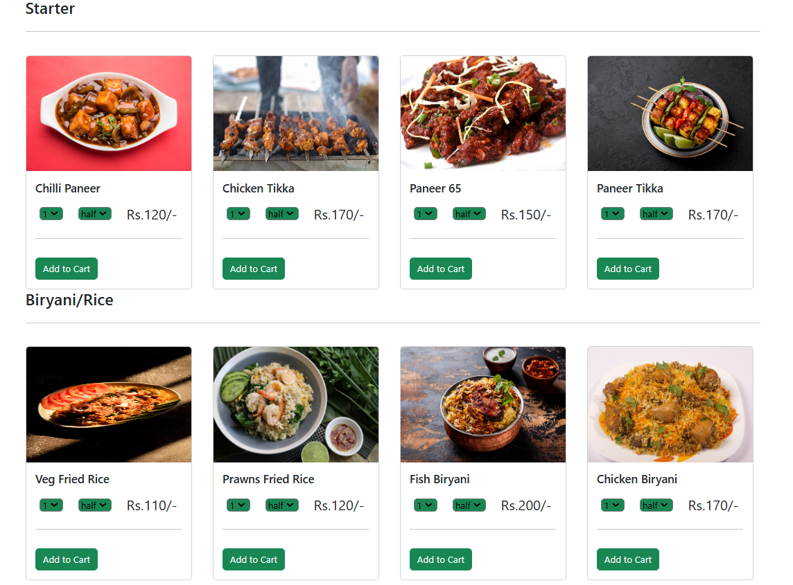

GoFood 🍔

GoFood is a full-stack food delivery web app built using the MERN stack (MongoDB, Express.js, React, Node.js). The application allows users to browse menus, place orders, and have their favorite meals delivered to their doorstep, providing a seamless and convenient dining experience.

Hero Section:

Home Page:

My Orders:

🛠️ Tech Stack

Frontend: React.js

Backend: Node.js, Express.js

Database: MongoDB

Authentication: JSON Web Tokens (JWT)

Other Tools: Axios, Mongoose, Thunder client (for API testing)

## Frontend command

npm start

## Backend command

node index.js